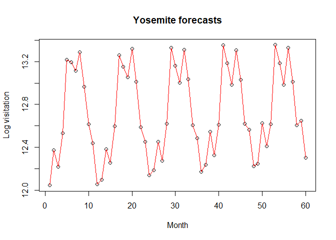

<!-- README.md is generated from README.Rmd. Please edit that file -->

# VisitorCounts

<!-- badges: start -->
<!-- badges: end -->

## Package Summary

The package **VisitorCounts** offers tools to estimate and forecast the
number of visitors or its percent changes to National Parks. Our method
works by employing singular spectrum analysis (SSA) to decompose
park-level photo-user-days (PUD) into estimated trend and seasonal
components. Here, PUD is the number of unique users per day that shared
an image from within a target location (such as the number of unique
users per day that shared geo-tagged Flickr images of the Yosemite
National Park). Following appropriate adjustments, these components can
be used as estimates or forecasts for the trend and seasonality
components of *Δ* log(*N*<sub>*i*, *t*</sub>) (where
*N*<sub>*i*, *t*</sub> &gt; 0 denote the actual visitor counts in month
*t* at park *i*). Therefore, by using the **VisitorCounts** package, one
can find the estimated or forecasted percent change in a park’s visitor
counts by only using social media data for that park. Our model is
unique in that, whereas other models partially or fully utilize on-site
visitor counts, ours can achieve competitive performances on visitation
forecasts only with the use of social media data. In addition,
visitation forecasts can be improved by combining PUD with partial or
full on-site visitor counts.

## Example

An example of using the VisitorCounts package is forecast- ing the
number of visitors to a national park for a specific month. Lets
estimate the number of visitors to the Yosemite National Park for the
month of August in 2022 using a model that relies on social media data
and previous on-site counts.

First load the VisitorCounts package:

``` r
library("VisitorCounts")
#> Registered S3 method overwritten by 'quantmod':
#>   method            from
#>   as.zoo.data.frame zoo
```

With VisitorCounts loaded, you will need to load the appropriate data
sets:

``` r
data("park_visitation")
```

The park\_visitation data set will be used to get the Flickr PUD data
for the Yosemite National Park. The flickr\_userdays data set will be
used as a proxy for the popularity of Flickr when creating a
visitation\_model object.

Let us then extract the Yosemite dataset and put it into a time series
with these two commands:

``` r
yosemite_pud <- park_visitation[park_visitation$park == "YOSE",]$pud #PUD data
yosemite_nps <- park_visitation[park_visitation$park == "YOSE",]$pud #On site recorded visitation
```

Before we create a Visitation\_Model object, we should log-transform
both the flickr\_userdays and yosemite\_pud for the best results.

``` r
log_yosemite_pud <- log(yosemite_pud)

log_yosemite_nps <- log(yosemite_nps)
```

Now we can create our visitation\_model that we will be doing
predictions with:

``` r
yose_visitation_model <- visitation_model(ref_series = log_yosemite_nps, onsite_usage = log_yosemite_pud, omit_trend = TRUE, parameter_estimates = "joint")
#> All the forecasts will be made in the log scale.
```

With this model, we will now be able to create our forecasts:

``` r
yosemite_visitation_forecasts <- predict(yose_visitation_model, n_ahead = 60)$forecast[1:60] 
```

In this context n\_ahead represents the number of months we will be
forecasting.I put the value as 60 because since our time series has data
up until the end of 2017 and I want to forecast for a month in 2022 I
will need to create forecasts for all the months through 2018 up until
that month in 2022. Alternatively, if n\_ahead had been set to 12 I
would only generate forecasts through the year of 2018.

Now we can plot these forecasts and look at the graph with the commands:

``` r
plot(yosemite_visitation_forecasts, main="Yosemite forecasts", type="l",xlab="Month", ylab="Log visitation")
points(yosemite_visitation_forecasts)
lines(yosemite_visitation_forecasts, col="red")
```



The graph is labeled as the number of months after the training data
predicted on the x-axis and the y axis is log base e of the visitation
to the park. Since our training data ends at 2017, one can read the
graph by selecting the numbered month after 2017 that they are
interested in. In our case we are looking for the number of visitors for
August 2022, which would be the 56th month after the end of 2017. By
looking at our graph we can see that the 56th month is about 13.
Moreover to get an actual estimate for visitation we calculate
*e*<sup>13</sup> = 442, 413, which would be the expected number of
visitors based on our model.

## Installation

You can install the current version of VisitorCounts with:

``` r
install.packages("VisitorCounts")
```

## Main Components

You can view an in-depth explanation of the main components for this
package through the included vignette.
